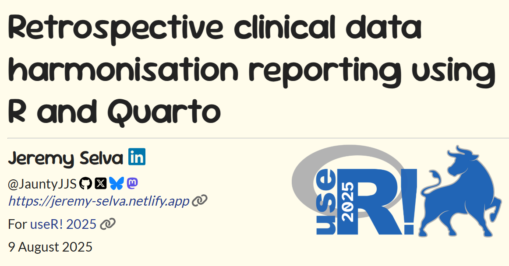

# Retrospective clinical data harmonisation reporting

Here are the
<a href="https://github.com/JauntyJJS/useR-2025_harmonisation"
target="_blank">source code</a> for my
<a href="https://jauntyjjs.github.io/useR-2025_harmonisation/"
target="_blank">slides</a> presented at
<a href="https://user2025.r-project.org/" target="_blank">useR! 2025</a>.

